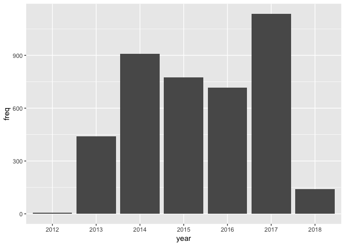
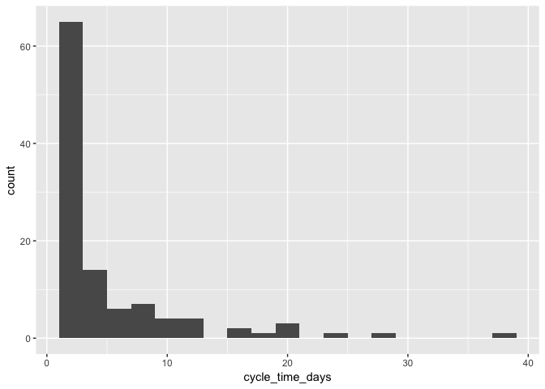
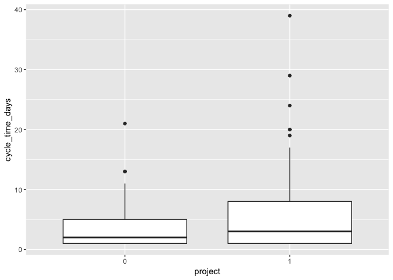
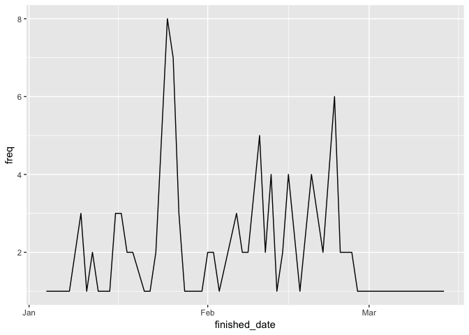

Details Agile Project Data Set
================

-----

This R-Notebook is a short introduction to the **agile project
dataset**. The data set contains anonymized project data from Jira.

``` r
require(ggplot2)
```

    ## Loading required package: ggplot2

The whole data set is stored in a csv file. Some of the observation may
not make sense. For example there are observations with a cycle time
*-1*. During a “migration or cleanup session” this may resulted in some
cases where finished date is before the created date.

``` r
df <- read.csv('data/jira.csv', sep = ',', header = T)
df$created_date <- as.Date(df$created_date)
df$finished_date <- as.Date(df$finished_date)
df$project <- as.factor(df$project)

head(df)
```

    ##         id project task created_date finished_date cycle_time_days
    ## 1 P0-T5052       0 5052   2015-02-05    2015-02-04              -1
    ## 2  P0-T326       0  326   2013-12-25    2013-12-24              -1
    ## 3 P0-T5056       0 5056   2015-10-16    2015-10-15              -1
    ## 4  P0-T324       0  324   2013-08-13    2013-08-31              18
    ## 5  P0-T325       0  325   2013-12-25    2013-12-24              -1
    ## 6  P0-T322       0  322   2014-09-17    2014-09-18               1

``` r
summary(df)
```

    ##         id       project       task       created_date       
    ##  P0-T1   :   1   0:2427   Min.   :   1   Min.   :2012-04-25  
    ##  P0-T100 :   1   1:1696   1st Qu.:1860   1st Qu.:2014-08-08  
    ##  P0-T1004:   1            Median :3040   Median :2015-11-05  
    ##  P0-T1005:   1            Mean   :3491   Mean   :2015-11-12  
    ##  P0-T1007:   1            3rd Qu.:4478   3rd Qu.:2017-02-25  
    ##  P0-T101 :   1            Max.   :8831   Max.   :2018-02-26  
    ##  (Other) :4117                                               
    ##  finished_date        cycle_time_days   
    ##  Min.   :2012-04-24   Min.   :  -1.000  
    ##  1st Qu.:2014-08-18   1st Qu.:  -1.000  
    ##  Median :2015-11-16   Median :   1.000  
    ##  Mean   :2015-11-22   Mean   :   9.678  
    ##  3rd Qu.:2017-03-05   3rd Qu.:   6.000  
    ##  Max.   :2019-08-08   Max.   :1140.000  
    ## 

The data set contains data from different years.

``` r
freq_year <- data.frame(table(format(df$created_date, format='%Y')))
names(freq_year) <- c('year', 'freq')
ggplot(data=freq_year, aes(x=year, y=freq)) + geom_bar(stat="identity")
```

<!-- -->

Let’s inspect the data from 2018.

``` r
df <- df[df$created_date > '2017-12-31',]
df <- df[df$cycle_time_days > -1,]
head(df)
```

    ##            id project task created_date finished_date cycle_time_days
    ## 1172 P1-T4425       1 4425   2018-01-22    2018-01-24               2
    ## 1174 P1-T4427       1 4427   2018-01-22    2018-01-23               1
    ## 1175 P1-T4426       1 4426   2018-01-22    2018-01-25               3
    ## 1176 P1-T4429       1 4429   2018-01-27    2018-02-06              10
    ## 1178 P1-T4430       1 4430   2018-01-23    2018-01-26               3
    ## 1179 P1-T4432       1 4432   2018-01-24    2018-02-17              24

We can plot the histogram of the cycle times from 2018.

``` r
ggplot(df, aes(x=cycle_time_days)) + geom_histogram(bins = 20)
```

<!-- -->

Another interesting aspect is the boxplot for the two projects in 2018.

``` r
ggplot(df, aes(x = project, y = cycle_time_days)) + geom_boxplot()
```

<!-- -->

Last we can plot the time series when Jira task were finished.

``` r
freq <- table(finished_date = df$finished_date)


time_series <- data.frame(freq)
time_series$finished_date <- as.Date(time_series$finished_date)
names(time_series) <- c('finished_date', 'freq')


ggplot( data = time_series, aes( finished_date, freq )) + geom_line() 
```

<!-- -->
